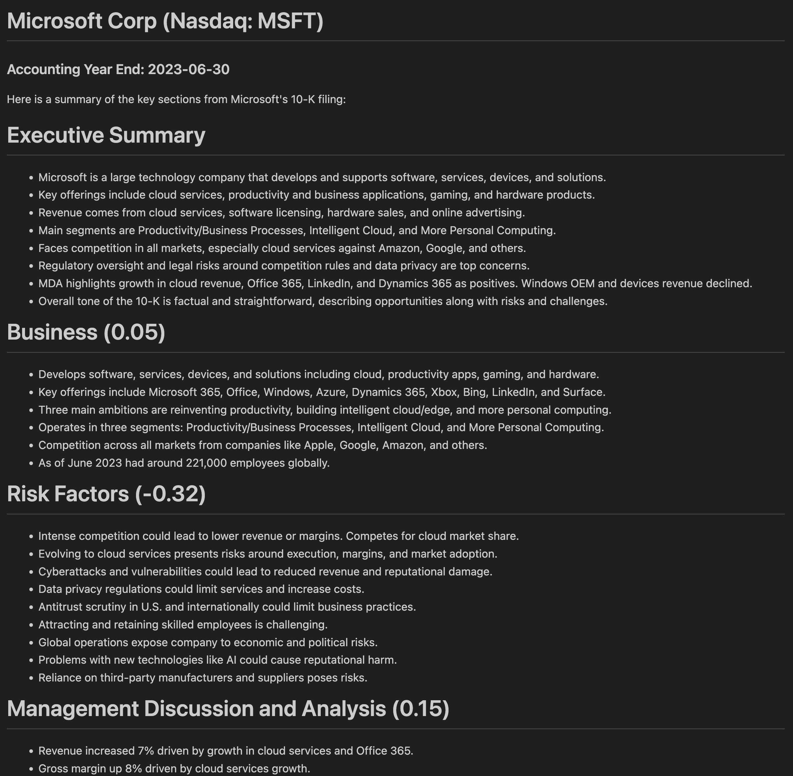

<h1 style="text-align: center;"><strong>Claude 2

SEC 10-K Company Analysis

## [July 2023 Hackathon](https://partiful.com/e/WLszTLRL4ftfhEqBtKGD)</strong></h1>

This project involves analyzing key sections of SEC 10-K annual report filings for public companies. Claude 2 is provided with text extracted from the following 10-K sections:

- Business
- Risk Factors  
- Management's Discussion and Analysis (MDA)
- Legal Proceedings
- Changes in and Disagreements with Accountants

Claude's role is to provide summaries of each section, along with a sentiment analysis giving each a continuous score between -1 and +1, indicating overall negative to positive tone.

For the MDA section, the chatbot is given the MDA text for the current and prior two fiscal years. The analysis will summarize the key changes over this three year period. 

The goal is to extract insights from these critical sections of 10-K filings to allow for quick analysis of the company's business, risks, operations and financial position. The continuous sentiment scoring aims to highlight concerning negative tones or positive optimistic tones in the disclosures. Analyzing MDAs over timeframes can identify trends in the company's performance.

This type of 10-K analysis could be useful for investment research, due diligence, or tracking trends across an industry. It demonstrates using NLP techniques to quickly parse and extract key information from long and complex regulatory filings.

The project will be presented at the Claude 2 hackathon. The chatbot will assist with analysis and summarization as the NLP component for this interesting application of natural language processing to financial regulatory documents.

---

# Contents
1. [Installation](#installation)
1. [Usage](#usage)
1. [Sample output](#sample-output)
1. [Tests](#tests)
1. [Open Issues](#open-issues)
1. [FAQs](#faqs)

# Installation

## Obtain required API keys

You first must obtain API keys for the two required services:

* [Claude 2](https://docs.anthropic.com/claude/reference/getting-started-with-the-api): Get your free API key [here](https://www.anthropic.com/index/claude-2/you-are-dreaming).
* [sec-api](https://sec-api.io): Sign up for a free API key [here](https://sec-api.io/signup/free)

## Create virtual environment

Create your project folder. Then create your virtual environment and activate it.

```console
cd my/project/folder
git clone [TODO: Insert repo link]
cd anthropic-sec-10k
python3 -m venv .venv
source .venv/bin/activate
```

## Install dependencies

Pip install the required dependencies.

```console
pip install -r requirements.txt
pip install -r requirements-dev.txt  # Developer requirements, e.g. testing.
```

# Usage

You can either pass a list of CIK values directly, e.g.

```console
python -m src.main 0000320193 0000858877 0000796343
```

or else put them in `data/ciks.txt` and run the code as follows:

```console
python -m src.main

2023-07-31 14:58:39.477 | INFO     | __main__:main:53 - 1/19: Getting 10-K data for CIK 0000320193 (Apple Inc.)...
2023-07-31 14:58:43.050 | INFO     | __main__:main:64 - Getting model response for CIK 0000320193 (AAPL)...
2023-07-31 14:59:53.302 | INFO     | __main__:main:53 - 2/19: Getting 10-K data for CIK 0000789019 (Microsoft Corp)...
2023-07-31 14:59:56.939 | INFO     | __main__:main:64 - Getting model response for CIK 0000789019 (MSFT)...
2023-07-31 15:01:16.509 | INFO     | __main__:main:53 - 3/19: Getting 10-K data for CIK 0001018724 (Amazon Com Inc)...
2023-07-31 15:01:19.954 | INFO     | __main__:main:64 - Getting model response for CIK 0001018724 (AMZN)...
2023-07-31 15:02:11.579 | INFO     | __main__:main:53 - 4/19: Getting 10-K data for CIK 0001652044 (Alphabet Inc.)...
...
```
# Sample output



# Tests

## 😂 🤣 😂

For a basic testing framework, run the following from the project's root directory after installing the developer requirements.

```console
pytest tests
```

The output should be similar to the following:

```console
============================================================ test session starts ============================================================
platform darwin -- Python 3.10.12, pytest-7.4.0, pluggy-1.2.0
rootdir: /Users/colin.alexander/Code/ds/anthropic-sec-10k
plugins: cov-4.1.0, integration-mark-0.2.0, anyio-3.7.1
collected 6 items                                                                                                                           

tests/test_utils.py ......                                                                                                            [100%]

============================================================= 6 passed in 0.02s =============================================================

```

# Roadmap

## Version 0.0.1 (Current)

* Summarize key sections (Business, Risk Factors, MDA, Legal, Accountants)
* Sentiment analysis of each section
* Compare MDA across 3 years

## Version 0.0.2 (Next 3 months)

* Expand summary analysis to additional sections (Corporate Governance, Security Ownership, etc)
* Generate overall 10-K report summary
* Improve change analysis for MDAs over 5 years
* Add company 10-K filing history database
* Implement web interface for entering company name
* Persist downloaded SEC filings

## Version 0.0.3 (Next 6 months)

* Summarize 10-Q filings
* Add executive compensation analysis
* Analyze auditor opinions and footnotes
* Track and compare sentiment over time
* Interactive charts and graphs
* Custom analysis for different industries

## Future Development

* Analysis of other SEC filings (8-K, proxies, etc)
* Financial statement analysis
* Compare across companies in industry
* Predictive analytics of risks
* Connect findings to external data sources
* Custom insight reports for investors

# Open Issues

Further work is needed to investigate the stability of the sentiment scores.

# FAQs

### What sections of the 10-K are analyzed?

The key sections analyzed are Business, Risk Factors, Management's Discussion and Analysis (MDA), Legal Proceedings, and Changes in and Disagreements with Accountants.

### What kind of insights can be gained from this analysis?

The summaries and sentiment scoring provide quick insights into the company's business, risks, operations, financial position, and accounting. Comparing MDAs over time can identify performance trends.

### How is sentiment analysis performed?

Sentiment scoring uses NLP techniques to analyze tone based on word choice, assigning a continuous score from -1 (very negative) to +1 (very positive) to each section.

### How are changes over time analyzed for the MDA?

The chatbot is provided historical MDAs and summarizes key changes in financials, metrics, risks, and outlook over a three year period.

### Where does the 10-K data come from?

The project uses extracted text from 10-K filings submitted to the SEC Edgar database.

### What is the intended use case for this analysis?

It enables rapid analysis for investment research, due diligence, or tracking industry trends.

### What NLP techniques are used?

The project applies NLP approaches such as summarization, sentiment analysis, and comparison of text over time.